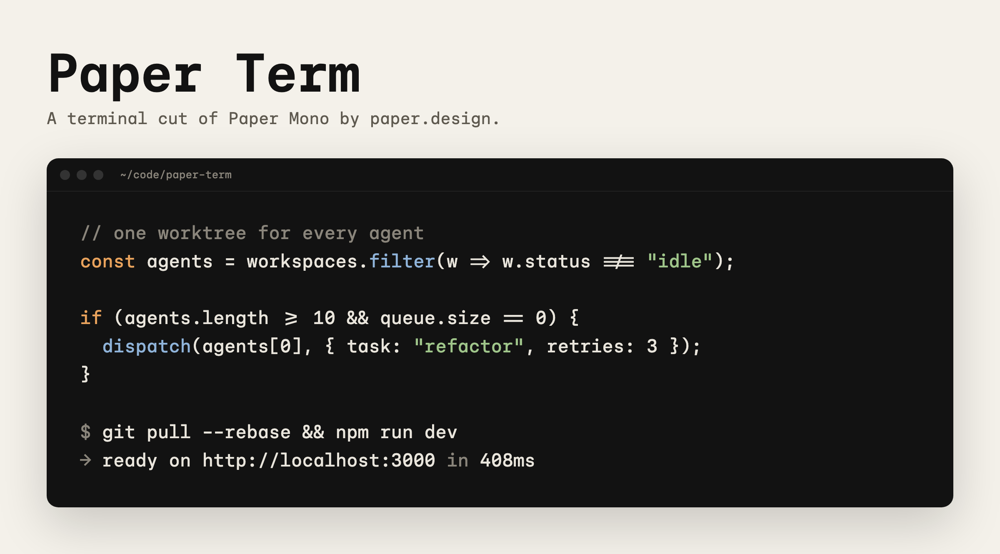
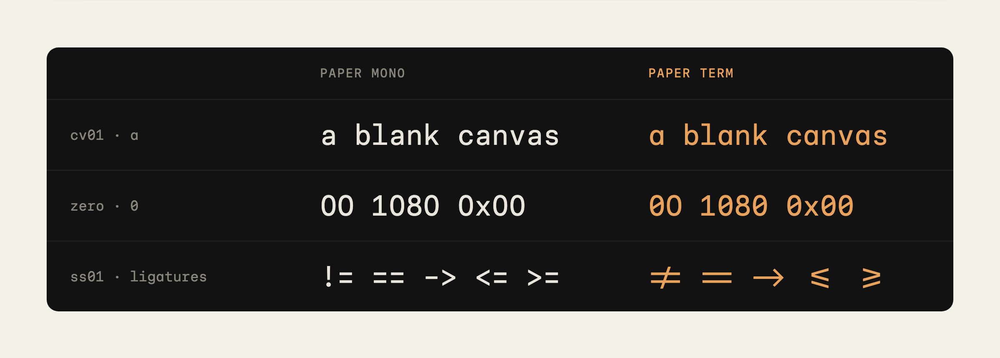
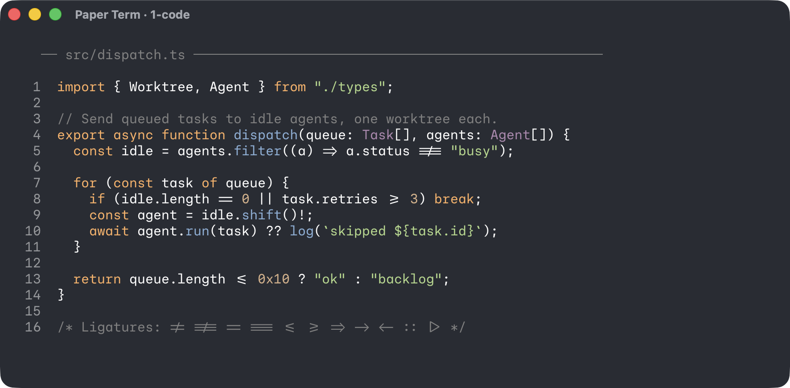
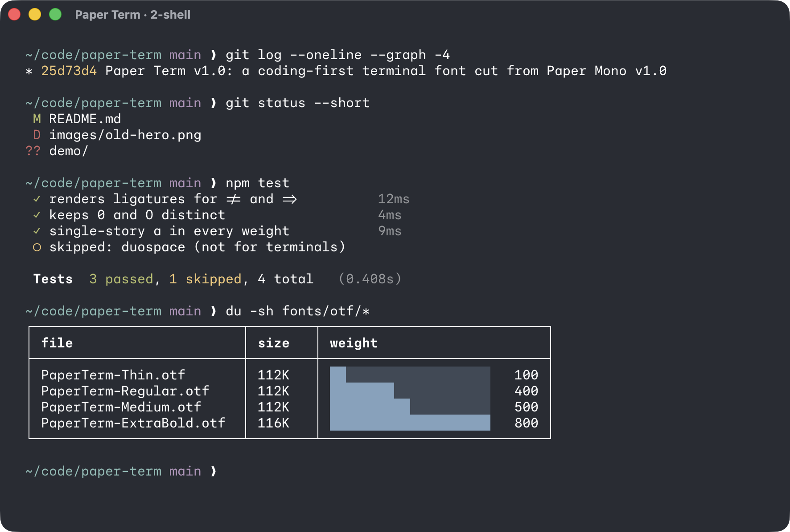
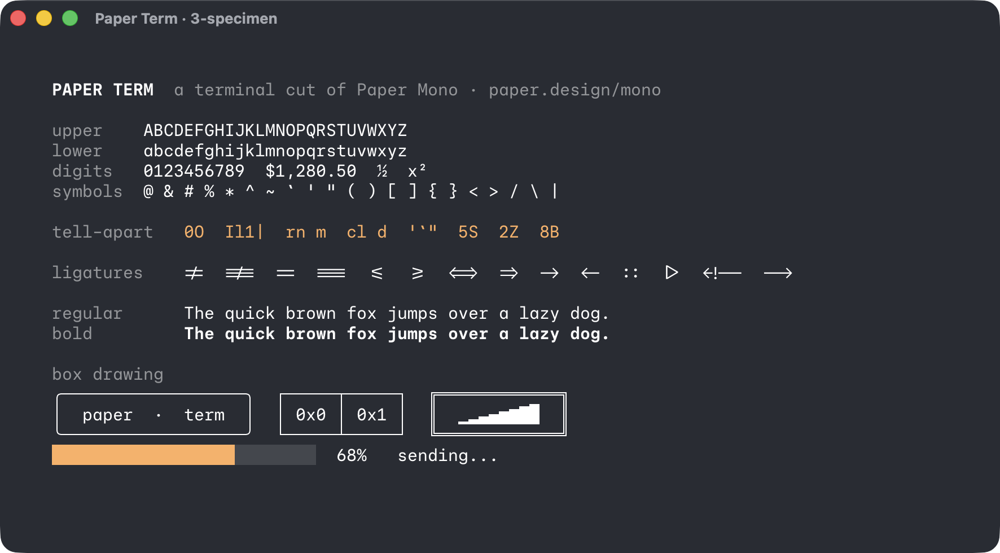

# Paper Term



**Paper Term is an opinionated, coding-first terminal font, cut from [Paper Mono](https://paper.design/mono), the new open-source monospace font from [Paper](https://paper.design).** All the design credit goes to them.

Paper Mono ships with a set of optional OpenType features. Most terminals and TUIs only let you choose a font family, so those features stay switched off. Paper Term bakes the coding-friendly ones in: you get a single-story a, a slashed zero and coding ligatures just by picking the font, in any terminal, editor or TUI.

## Install with your agent

Copy this prompt into Claude Code, Codex or any coding agent that can run commands on your machine:

```text
Install the Paper Term font for me.

1. Download https://github.com/sincereTrader/paper-term/releases/download/v1.0/PaperTerm-v1.0.zip into a new temporary folder and unzip it.
2. Install every .otf file from the zip for my user account:
   - macOS: copy them into ~/Library/Fonts
   - Linux: copy them into ~/.local/share/fonts, then run fc-cache -f
   - Windows: copy them into %LOCALAPPDATA%\Microsoft\Windows\Fonts and register each one under HKCU\Software\Microsoft\Windows NT\CurrentVersion\Fonts
3. Confirm the font family "Paper Term" is now installed, then delete the temporary folder.
4. Find out which terminal app I use, show me the setting that switches its font family to "Paper Term", and change it only if I say yes. Then tell me to fully quit and reopen the terminal.

Don't change any other settings on my machine.
```

## What's different from Paper Mono



| Feature | Paper Mono | Paper Term |
|---|---|---|
| `cv01` single-story a | Off | **On** |
| `zero` slashed zero | Off | **On** |
| `ss01` coding ligatures | Off | **On** (folded into `calt`) |
| `ss04` small arrows | Off | Off |
| `ss02` duospace, `ss03` narrow space | Off | Off: these break a terminal's fixed character grid |

Everything else is untouched: same glyphs, same metrics, all 8 weights from Thin (100) to ExtraBold (800).

## In a real terminal

Screenshots from [Ghostty](https://ghostty.org) at 15px, using its default theme. Run the scripts in [`demo/`](demo) to see it in your own terminal.







## Install manually

1. Download the latest zip from [Releases](../../releases), or grab the files in [`fonts/otf`](fonts/otf).
2. **macOS:** double-click each `.otf` and choose *Install*, or copy them into `~/Library/Fonts`.
   **Windows:** right-click the files and choose *Install*.
   **Linux:** copy them into `~/.local/share/fonts` and run `fc-cache -f`.
3. Fully quit and reopen your terminal so it picks up the new font.

## Set it in your terminal

TUIs like Claude Code, Codex, Vim, Neovim and htop use whatever font your terminal uses, so set it once in the terminal and they all pick it up.

| Terminal | Setting |
|---|---|
| **Ghostty** | `font-family = "Paper Term"` in your config |
| **Kitty** | `font_family Paper Term` in `kitty.conf` |
| **WezTerm** | `config.font = wezterm.font("Paper Term")` |
| **Alacritty** | `[font.normal]` then `family = "Paper Term"`. Alacritty doesn't render ligatures |
| **iTerm2** | Settings → Profiles → Text → Font, and tick *Use ligatures* |
| **Windows Terminal** | Settings → your profile → Appearance → Font face |
| **VS Code** | `"terminal.integrated.fontFamily": "Paper Term"`, plus `"editor.fontFamily"` for the editor |
| **[Orca](https://www.onorca.dev)** | Settings → Terminal → Font Family. Set *Terminal Ligatures* to *on* if ligatures don't show |

The single-story a and the slashed zero work everywhere. Ligatures depend on the app: if `!=` and `->` still look like separate characters, look for a ligatures setting in your terminal or editor.

## Build it yourself

Paper Term is built from Paper Mono v1.0 with one small script. When Paper releases a new version, you can rebuild it yourself:

```sh
pip install fonttools
python scripts/build.py path/to/paper-mono/fonts/otf fonts/otf
```

To pick different features, edit `BAKED_SINGLE_SUBS` and `FOLDED_INTO_CALT` at the top of [`scripts/build.py`](scripts/build.py).

## Notes

- **Not maintained.** I made this for my own setup and published it as is. It won't track new Paper Mono releases, so use the script above to rebuild from a newer version.
- **Unofficial.** Paper Term isn't made or endorsed by Paper. It's a community remix.

## License

Paper Mono is Copyright 2025 The Paper-Mono.Git Project Authors ([github.com/paper-design/paper-mono](https://github.com/paper-design/paper-mono)) and licensed under the [SIL Open Font License 1.1](OFL.txt). As a modified version, Paper Term is released under the same license, with a different name, as the OFL requires. The build script is free to use under the same terms.
